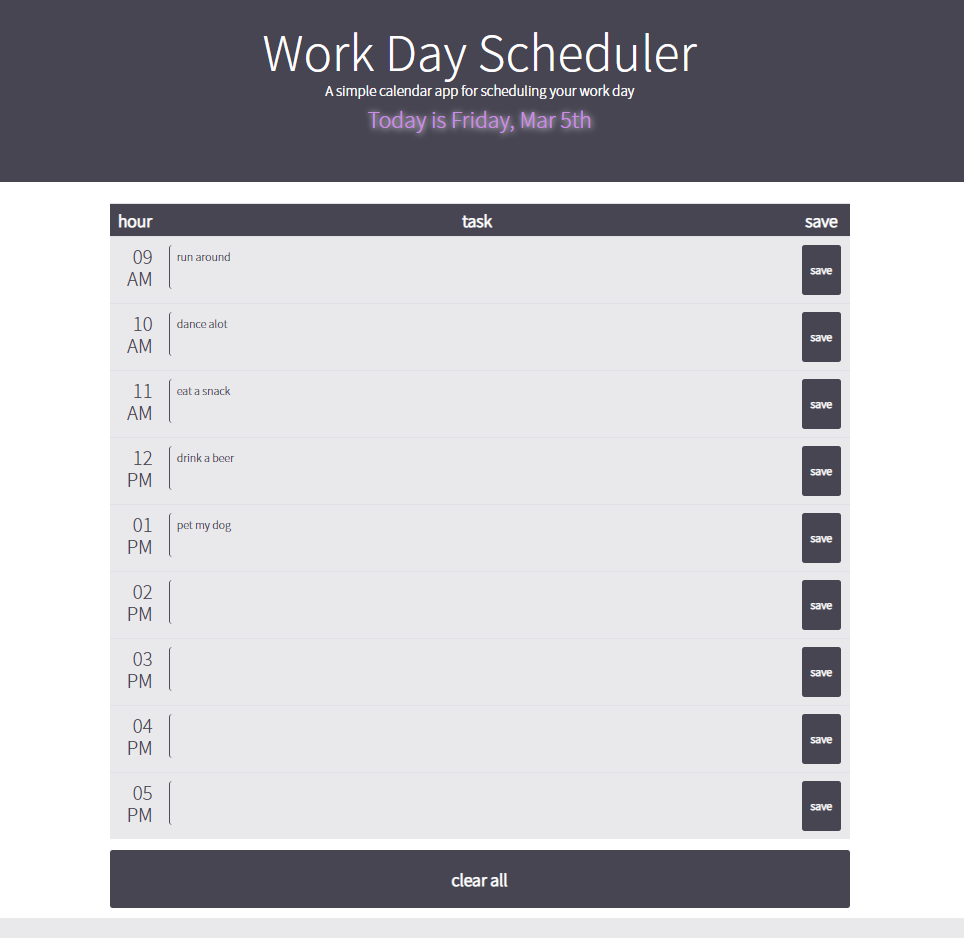
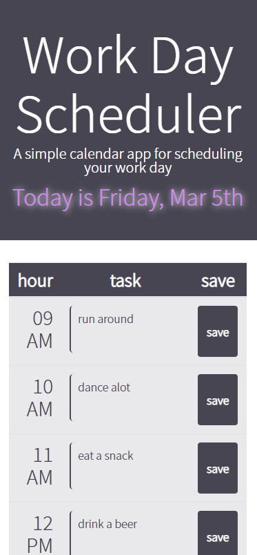

# Day Planner App

## Link to deployed site:
https://ray0095.github.io/dayplanner/ 

## Description 
The following files contain the necessary assets to deploy a functional day planner website that dynamically changes colors with the hour of the day. Users are able to edit and save their action items within the appropriate time block. 

## Table of Contents

* [Installation](#installation)
* [Features](#features)
* [Screenshots](#screenshots)

## Installation

To use this site for your own website or your client's website, follow these steps: 
    1. Fork this repo 
    2. Create a local clone of your fork 
    3. Change styles to fit your branch :)

## Features

Time blocks change with the current time of day. Action items can be saved to local storage and persisted. Action items can be cleared with the click of a button.  

# Screenshots

